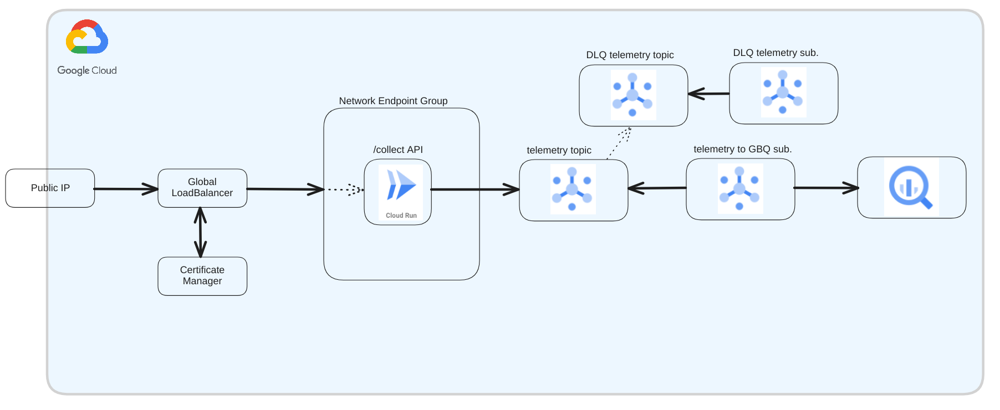

# Telemetry pipeline


## Setup

Replace the values in the file `terraform.tfstate.json` with your GCP project details


## Install

1. Run the following command at the root of the folder (you must ideally have `owner` IAM rights on the project, or enough permissions to create the resources):
```shell 
$ ./install.sh
$ terraform init
$ terraform plan
$ terraform apply
```

2. Build and deploy the container image using Cloud Build into your Cloud Run service:
```shell 
$ ./deploy.sh
```


3. Once all resources have been created, run this from a terminal (or the Cloud Shell in the same project)
```shell
curl -X POST -H "Authorization: Bearer $(gcloud auth print-identity-token)" -H "Content-Type: application/json" -d '{"source": "web", "category": "navigation", "id": "page-view", "projectId": "<uuid>", "timeStamp": "2024-10-29T16:55:33Z", "payload": {"pageName": "ifcs"}}' https://<DOMAIN>/collect
```

This will add one line in the bigquery dataset.table